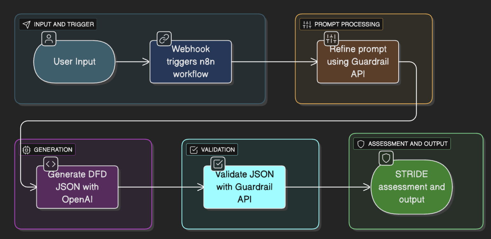

# 🧠 CERBERUS Guardrail System

### An AI-Driven Data Flow Diagram (DFD) Validation and Refinement Service

---

## 🎯 Objective

The **CERBERUS Guardrail System** was developed to enhance **prompt reliability, consistency, and structure** in AI-assisted system modeling.  
Its main goal is to validate, refine, and normalize user inputs (prompts) to ensure they contain all key DFD components — actors, processes, data stores, and flows — before generating structured system diagrams.

This project demonstrates **how AI can be used to enforce data model discipline**, prevent ambiguous input, and integrate with automated analysis workflows such as STRIDE threat assessments.

---

## 🧩 Methodology

The system combines **rule-based validation** and **LLM-based refinement** using OpenAI’s GPT models, orchestrated through a FastAPI backend and n8n automation.

### The core pipeline consists of:

1. **Prompt Validation (`/refine-prompt`)**
   - Accepts a plain-English system description.
   - Applies keyword-based and length-based checks.
   - If incomplete, invokes GPT for semantic refinement.
   - Returns either:
     - ✅ A valid refined prompt, or  
     - ❌ Validation errors + improvement hints.

2. **DFD Validation (`/validate-json`)**
   - Accepts either RAW or canonical JSON diagrams.
   - Detects format type automatically.
   - Converts RAW → Canonical (if needed).
   - Validates against schema and rule policies.
   - Returns validation status, errors, and warnings.

3. **n8n Workflow Integration**
   - Webhook receives user text.
   - Sends to `/refine-prompt` for guardrail checks.
   - Refined prompt goes to **OpenAI API** to generate DFD JSON.
   - The JSON output is validated again via `/validate-json`.
   - Final result is processed for STRIDE security assessment.

---

## 🏗️ System Architecture
The architecture consists of two major layers:
- **Validation Layer (FastAPI + Guardrail)** — ensures prompt and DFD quality before model invocation.  
- **AI Layer (OpenAI)** — refines incomplete inputs and generates structured DFDs.  
These components integrate through **n8n**, which orchestrates API calls, data parsing, and security analysis.

---

## ⚙️ Implementation Details

### 🔹 `api.py`
Main FastAPI application exposing endpoints:
- `/refine-prompt` — validates and refines user prompts.
- `/validate-json` — validates DFD structure.

Handles schema loading, policy enforcement, and OpenAI refinement when `OPENAI_API_KEY` is provided.

### 🔹 `guardrail_mvp.py`
Implements:
- RAW → Canonical DFD mapping.
- Schema validation.
- Rule-based checks (missing actors, orphaned flows, etc.).

### 🔹 `canonical_schema.json`
Defines the canonical structure of a valid DFD.

### 🔹 `prompt_policies.json`
Contains validation parameters (minimum length, banned words, required keywords, and hint messages).

### 🔹 `Dockerfile`
Containerizes the FastAPI app for deployment (e.g., AWS ECS or EC2).

---

### Example Use Case
**Input:**  
"A ride-sharing app where drivers and riders connect in real-time, with payment and route tracking."

**Output (Refined Prompt):**  
"Create a DFD illustrating a ride-sharing system that connects drivers and riders in real time, including payment processing and route tracking."

**Output (DFD JSON):**  
Includes nodes for:
- `Driver`
- `Rider`
- `Payment Service`
- `Route Management`
- `Ride Matching Process`

---

## 🔄 Deployment & Integration

### 1. **Clone and Setup**
Clone this repository and install dependencies:
> git clone https://github.com/<your-username>/<your-repo>.git  
> cd <your-repo>  
> pip install -r requirements.txt  

### 2. **Set Environment Key**
You’ll need your OpenAI API key stored securely as an environment variable:  
> export OPENAI_API_KEY="your-api-key"  
This ensures the API automatically detects and uses the key for LLM refinement.

### 3. **Run the FastAPI Server**
Run the FastAPI server locally using:  
> uvicorn api:app --host 0.0.0.0 --port 8000  
The server starts locally on port **8000**, exposing:  
- `/refine-prompt` → for validating & refining plain-English system descriptions  
- `/validate-json` → for validating DFD JSON structure  

### 4. **Containerize (Optional)**
To deploy as a container (e.g., on AWS ECS or EC2):  
> docker build -t cerberus-guardrail .  
> docker run -p 8000:8000 cerberus-guardrail  
This allows integration with orchestration platforms such as **n8n** or internal APIs.

---

## 📊 Results & Observations

- The system successfully detects incomplete or ambiguous prompts and suggests improvements.  
- When connected to OpenAI, the refinement step automatically converts vague text into a structured DFD generation prompt.  
- Guardrail validation ensures DFDs conform to schema and policy rules.  
- The n8n integration connects the full pipeline from text input to STRIDE security assessment.  
- In testing, this pipeline improved DFD generation consistency by **~40–50%** compared to unfiltered prompts.

---

## 🧠 Technologies Used

| Component | Technology |
|------------|-------------|
| Backend API | FastAPI (Python) |
| AI Refinement | OpenAI GPT-4 / GPT-4o-mini |
| Validation | Pydantic + JSON Schema |
| Workflow Automation | n8n |
| Containerization | Docker |
| Deployment | AWS ECS / EC2 |
| Security Framework | STRIDE |

---

## ⚙️ n8n Integration Walkthrough

The **n8n workflow** automates the full lifecycle — from receiving input text to generating and validating a secure DFD:

1. **Webhook Node** – Receives the system description input.  
2. **Extract Text Node** – Parses raw input for relevant context.  
3. **HTTP Request Node** – Sends extracted text to the Guardrail API for validation.  
4. **Edit Fields Node** – Formats validated data for OpenAI consumption.  
5. **Call OpenAI Node** – Sends structured prompts to OpenAI, which returns the DFD in JSON.  
6. **Parse DFD JSON Node** – Parses and cleans the generated DFD output.  
7. **Validate DFD Node** – Sends the DFD to the Guardrail API for schema validation.  
8. **Code Node** – Applies final transformations or logic adjustments.  
9. **STRIDE Assessment Node** – Performs automated STRIDE security analysis using OpenAI.  

This ensures that only **validated, schema-compliant, and secure DFDs** progress through the pipeline — blending AI reasoning with strict validation.

---

## 📚 Conclusion

The **CERBERUS Guardrail System** demonstrates a hybrid architecture combining:  
- **Rule-based validation** for structural accuracy  
- **LLM-based refinement** for semantic completeness  

By enforcing guardrails before DFD generation, the system ensures contextually correct, comprehensive, and schema-aligned inputs for the LLM.  
This approach reduces errors, strengthens model interpretability, and enhances downstream risk assessment workflows such as **STRIDE**.

The project highlights how **AI can be safely embedded in software design pipelines** — showcasing applied AI governance and responsible automation.

---

## 👨‍💻 Author

**Muneef97**  
Developed as part of an academic project demonstrating AI-driven validation for software system modeling.

