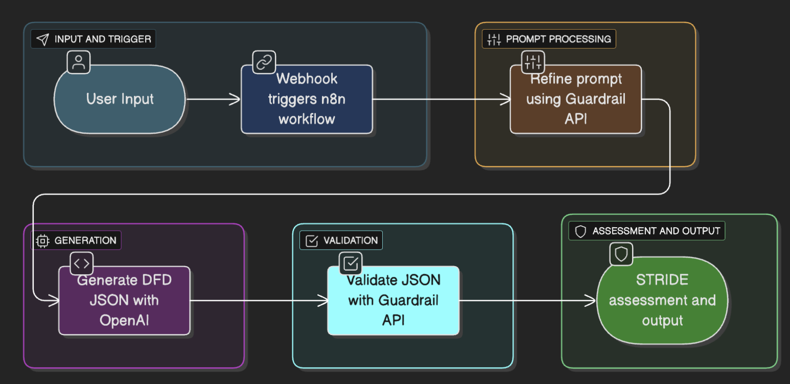

# 🧠 CERBERUS Guardrail System

### An AI-Driven Data Flow Diagram (DFD) Validation and Refinement Service

---

## 🎯 Objective

The **CERBERUS Guardrail System** was developed to enhance **prompt reliability, consistency, and structure** in AI-assisted system modeling.  
Its main goal is to validate, refine, and normalize user inputs (prompts) so they include the key DFD elements — **actors, processes, data stores, flows, and trust boundaries** — before generating structured system diagrams.

This project shows how **AI + rules** can enforce data-model discipline, prevent ambiguous input, and integrate with downstream analysis such as **STRIDE** and **DREAD**.

---

## 🧩 Methodology

CERBERUS combines **rule-based validation** with **LLM-based refinement** via a FastAPI backend. The pipeline is orchestrated primarily with **LangGraph** (n8n is supported as an optional runner).

**Core steps**

1. **Prompt Validation — `/refine-prompt`**  
   Accepts a plain-English system description, applies length/keyword checks, and (when enabled) calls the LLM to rewrite into a single instruction (e.g., *“Create a DFD illustrating …”*). Returns either a refined prompt ✅ or errors + actionable hints ❌.

2. **DFD Validation — `/validate-json`**  
   Accepts **RAW** editor JSON or **Canonical** DFD JSON. Auto-detects format and maps RAW → Canonical if needed. Enforces **JSON Schema** + custom rules (duplicate IDs, self-flows, orphan nodes, cross-boundary non-HTTPS warnings, empty graph, invalid protocol tokens). Returns `valid`, `errors`, `warnings`, and normalized output.

3. **Orchestration (LangGraph / n8n)**  
   refine → LLM generate DFD JSON → validate → STRIDE/DREAD assessment → visualize/export.

---

## 🏗️ System Architecture

Two layers:

- **Validation Layer (FastAPI + Guardrail):** verifies prompts and DFDs before any analysis.  
- **AI Layer (OpenAI):** refines prompts and generates DFD JSON when enabled.

These layers are connected by an **agent workflow** (LangGraph primary; n8n optional).

> Place `guardrail_arch.png` at the repo root (or update the path) so GitHub can render it.

---

## ⚙️ Implementation Details

### `api.py`
Exposes:
- `POST /refine-prompt` — validate/refine user prompts  
- `POST /validate-json` — validate DFD JSON (RAW or Canonical)

Loads schema/policies and uses the LLM when `OPENAI_API_KEY` is present.

### `guardrail_mvp.py`
- RAW → Canonical mapper  
- JSON Schema validation  
- Rule checks: global node-ID uniqueness, duplicate flow IDs, self-flows, orphans, cross-boundary non-HTTPS warning, empty graph, invalid protocol tokens, etc.

### `canonical_schema.json`
Canonical, human-readable DFD schema (nodes, flows, trust boundaries, metadata).

### `prompt_policies.json`
Validation thresholds (min length, banned words, soft keyword hints) used by `/refine-prompt`.

### `Dockerfile`
Container image for deployment (ECS/EC2, etc.).

---

## 🔎 Example Use Case

**Input**  
“A ride-sharing app where drivers and riders connect in real-time, with payment and route tracking.”

**Refined Prompt (output)**  
“Create a DFD illustrating a ride-sharing system that connects drivers and riders in real time, including payment processing and route tracking.”

**DFD JSON (output, summarized)**  
Nodes for `Driver`, `Rider`, `Payment Service`, `Route Management`, `Ride Matching Process`, and directed flows between them, plus a trust boundary around public-facing components.

---

## 🔄 Deployment & Integration

### 1. Clone and Setup
> git clone https://github.com/<your-username>/<your-repo>.git  
> cd <your-repo>  
> pip install -r requirements.txt

### 2. Set Environment Key
> export OPENAI_API_KEY="your-api-key"  
(Only needed to enable LLM refinement in `/refine-prompt`.)

### 3. Run the FastAPI Server
> uvicorn api:app --host 0.0.0.0 --port 8000

The server exposes:
- `/refine-prompt`  
- `/validate-json`

### 4. Containerize (Optional)
> docker build -t cerberus-guardrail .  
> docker run -p 8000:8000 cerberus-guardrail

---

## 🧪 Benchmark & Test Cases

This repository includes a small benchmark script to validate the guardrail pipeline end-to-end.

### 1) Start the API (No LLM — fast regex/heuristics path)
> python -m uvicorn api:app --host 0.0.0.0 --port 8000

### 2) Run the benchmark (No LLM)
> python guardrail_benchmark.py --api http://127.0.0.1:8000 --n 100 --label no-llm  
>   
> === Refine Benchmark Summary: no-llm ===  
> Total: 100  
> Valid: 86 (86.0%)  
> Invalid: 14 (14.0%)  
> Latency: mean=0.001s  p50=0.001s  p95=0.002s  
> Top invalid reasons/hints:  
> &nbsp;&nbsp;&nbsp;14  Ambiguous or incomplete. Include actors, processes, data stores, and at least one flow.  
> Saved: refine_results_no-llm.csv

### 3) Start the API with LLM **ON**
> export OPENAI_API_KEY="your-api-key"  
> python -m uvicorn api:app --host 0.0.0.0 --port 8000

### 4) Run the benchmark (LLM ON)
> python guardrail_benchmark.py --api http://127.0.0.1:8000 --n 10 --label llm-on  
>   
> === Refine Benchmark Summary: llm-on ===  
> Total: 10  
> Valid: 10 (100.0%)  
> Invalid: 0 (0.0%)  
> Latency: mean=2.135s  p50=2.205s  p95=2.556s  
> Saved: refine_results_llm-on.csv  
>   
> Validate canonical_ok: 0.051s  valid=True  
>   
> Validate raw_like: 0.002s  valid=True  
>   
> Validate malformed: 0.001s  valid=False

**Notes**  
- The `--api` flag expects the **base URL** (e.g., `http://127.0.0.1:8000`), not `/docs`.  
- CSV outputs are written to the repo root (`refine_results_*.csv`).  
- Enabling the LLM increases latency but improves acceptance.

---

## 📊 Results & Observations

- **Refine (No LLM):** 86/100 prompts accepted (**86%**). Typical latency ~**1 ms**.  
  Most common rejection: *“Ambiguous or incomplete. Include actors, processes, data stores, and at least one flow.”*
- **Refine (LLM ON):** 10/10 prompts accepted (**100%**). Mean latency ~**2.1 s**.  
  The LLM consistently rewrote vague input into a concise, DFD-suitable instruction.
- **Schema/Rule smoke tests:**  
  `canonical_ok` → **valid=True**; `raw_like` → **valid=True** after RAW→Canonical mapping;  
  `malformed` → **valid=False** with expected required-field errors.
- **Net effect:** LLM refinement materially improves acceptance/quality at the cost of ~2 s latency;  
  the guardrail reliably blocks malformed payloads and emits actionable hints.

---

## 🧠 Technologies Used

| Component            | Technology                         |
|---------------------|------------------------------------|
| Backend API         | FastAPI (Python)                   |
| AI Refinement       | OpenAI GPT-4 / GPT-4o-mini         |
| Validation          | JSON Schema + custom rules         |
| Orchestration       | **LangGraph** (primary), n8n (opt) |
| Graph Store         | Neo4j (DFD + threats)              |
| Visualization       | Flutter UI (overlay/list)          |
| Security Framework  | STRIDE + DREAD                     |
| Containerization    | Docker                             |
| Deployment          | AWS ECS / EC2 (optional)           |

---

## 📚 Conclusion

The **CERBERUS Guardrail System** couples:
- **Rule-based validation** for structural accuracy, and  
- **LLM-based refinement** for semantic completeness.

By enforcing guardrails **before** diagram generation, CERBERUS produces contextually correct, schema-aligned inputs that improve downstream security analysis (STRIDE/DREAD) and reduce rework. The result is a more reliable, auditable, and faster threat-modeling workflow.

---

## 👨‍💻 Author

**Muneef97** — Academic project showcasing AI-driven validation for software system modeling.
